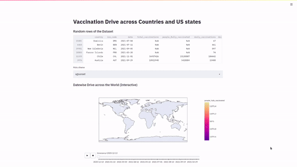

# Vaccination Drive across Countries and US states

### [WebApp Link](https://worldvaccine.herokuapp.com/)
 

### Visualize vaccination drive and compare among different countries and states (US).
 

### Interactive Graphs : 
- different bar and line graphs
- world and US maps with timeline animation.
- pdf report download function (some bugs).

 

###  Live data (world) from [github](https://raw.githubusercontent.com/owid/covid-19-data/master/public/data/vaccinations/vaccinations.csv ) 

###  Live data (US) from [github]('https://raw.githubusercontent.com/owid/covid-19-data/master/public/data/vaccinations/us_state_vaccinations.csv')

 

 

### Requirements : 
- plotly
- streamlit
- pandas
- fpdf

[ LinkedIn](https://www.linkedin.com/in/aman-patyal-675758218/)

## Any feedback is Welcome. Thankyou for visiting.